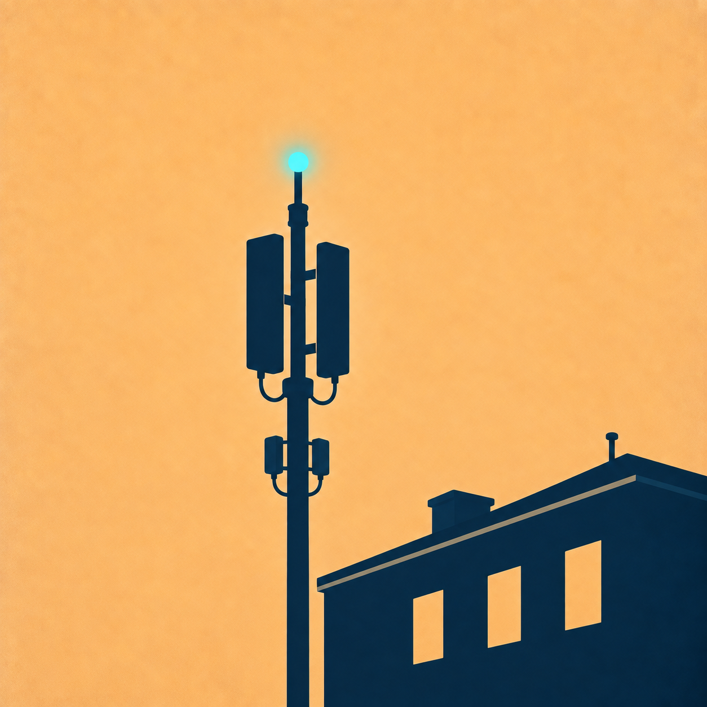

# Lighthouse

### [⬇ Скачать последнюю версию](https://github.com/Severoff03/lighthouse-network-scanner/releases/latest)

**Lighthouse** — приложение для диагностики доступности сетевых сервисов и наблюдения за радиосредой. Оно показывает результаты измерений вместе с деталями проверки и сохраняет историю на устройстве. Публичные файлы Windows и Android, когда оба доступны, используют один номер версии.

| Раздел | Возможности |
| --- | --- |
| **Network** | DNS, TCP, HTTPS и другие проверки сервисов; история, категории, подробности ответа, отдельная доступность настроенных VPN-адресов. |
| **Radio** | Wi‑Fi, Bluetooth, Cell и спутниковая навигация; графики, списки, поиск, фильтры и радиомониторинг с экспортом CSV на Android. |
| **Tools** | Сканирование IP-адресов локальных подсетей и инструменты управления, доступные на конкретном устройстве. |
| **Settings** | Тема, язык, разрешения, параметры проверки и поиск обновлений. |

## Установка

На странице последнего выпуска загрузите **Lighthouse-Windows-vX.Y.Z.zip**. Windows-архив нужно распаковать полностью и запустить `Lighthouse/Lighthouse.exe`; встроенная Java находится рядом с EXE. Android APK публикуется только при наличии release-подписи и имеет имя **Lighthouse-Android-vX.Y.Z.apk**. Отладочные APK остаются локальными и на GitHub не загружаются. Для обновления Android поверх предыдущей установки подпись APK должна совпадать.

Также выпускается переносимый Java-архив **Lighthouse-PC-vX.Y.Z.zip**, для которого требуется Java 17+.

## Что означают результаты

Состояние сервиса основано на реальных ответах выполненных запросов и может отличаться между DNS, TCP и HTTPS. Проверка VPN-адреса или страницы подписки показывает только доступность адреса/порта, **не** подтверждает работу VPN-туннеля, ключа или отдельного сервера внутри подписки. Радиоданные зависят от возможностей телефона, разрешений Android и ограничений системы; неизвестные поля не подменяются выдуманными значениями.

Для установки обновления Lighthouse сначала предлагает новую версию. Android скачивает APK, сверяет его размер и SHA-256 с данными GitHub Release, затем проверяет имя пакета, версию и подпись и открывает системный установщик. Windows сверяет ZIP с SHA-256 GitHub перед заменой файлов. На Android окончательное подтверждение установки всегда остаётся за системой.

## Исходный код

В репозитории находятся только исходники приложения, изображения, необходимые для него, и файлы Gradle. Локальный сборщик выпусков, журналы, старые сборки, личные настройки и ключи подписи не публикуются. Программа сохраняет историю и радиожурналы локально; API-токены пользователя не входят в исходники.

© Mothman
